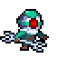

#  Wargroove RL


## Getting Started

### Prerequisites

Install [Docker](https://docs.docker.com/get-docker/) and [Docker Compose](https://docs.docker.com/compose/install/) to make use of the `docker-compose.yml` file

### Installation

1. Clone the repo
   ```sh
   git clone https://github.com/gp27/wargroove-rl.git
   cd wargroove-rl
   ```
2. Build the image and 'up' the container.
   ```sh
   docker-compose up -d
   ```

### Test Environment

```sh
docker-compose exec app python3 test.py -d -g 1 -a human human
```

### Train

```sh
docker-compose exec app python3 train.py
```

## Todo List

1. finish to implement the basic game in wagroove_game.py
2. restruture the wargroove_data.py

   - change the map definitions structure and move to their own folder as json files
   - organize configurable parameters that are used to generate observations like MAX_MAP_SIZE, MAP_PLAYERS, MAX_UNITS, all categoricals...

3. Replace the placeholder model
4. configure wandb

## Acknowledgements

The selfplay code is based on the SIMPLE (Selfplay in MultyPlayer Environments) project by David Foster:

https://github.com/davidADSP/SIMPLE
